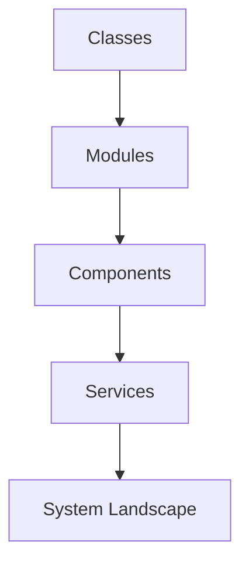
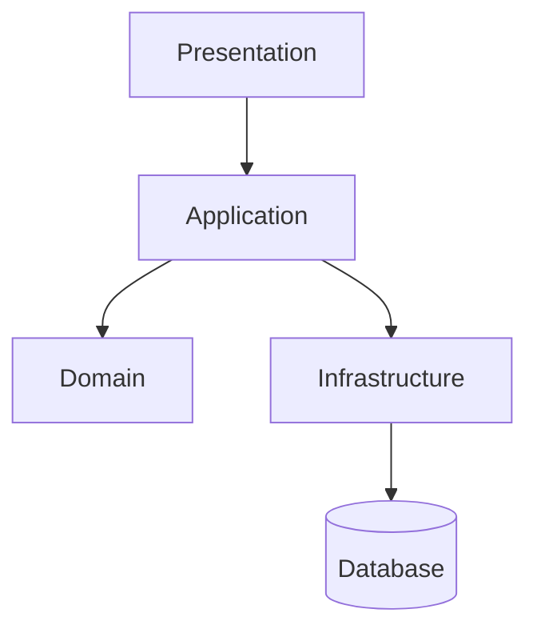
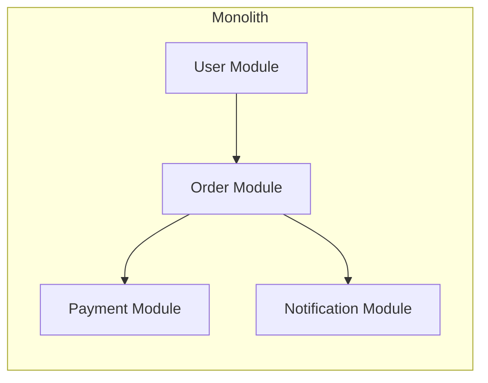
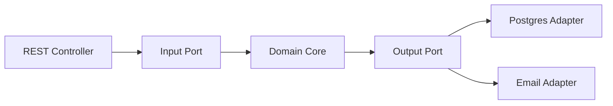
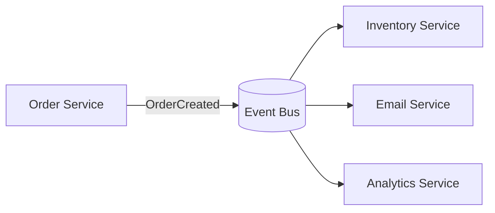

# Nền tảng Software Architecture

> Đây là phần khung xương của toàn bộ bộ tài liệu. Nếu hiểu rõ phần này, bạn sẽ dễ nối design pattern, application architecture và system design thành một bức tranh thống nhất.

## Tóm tắt nhanh

| Chủ đề | Câu hỏi cốt lõi |
|---|---|
| Nguyên lý nền tảng | Phần nào nên chịu trách nhiệm gì? |
| Architecture style | Tổ chức hệ thống theo kiểu nào? |
| NFR | Hệ thống cần tốt ở điểm nào ngoài chức năng? |
| Decision making | Vì sao chọn phương án này thay vì phương án khác? |

---

## 1. Software Architecture là gì

Software architecture là tập hợp các quyết định cấp cao về cấu trúc hệ thống:

- thành phần nào tồn tại
- chúng giao tiếp thế nào
- dữ liệu đi qua đâu
- boundary ở đâu
- cách system đáp ứng yêu cầu phi chức năng

Nó không chỉ là sơ đồ. Nó là cách tổ chức system để:

- dễ thay đổi
- dễ vận hành
- dễ scale
- dễ chia việc cho team

## 2. Các nguyên lý cốt lõi

> Nếu phải nhớ ít nhất, hãy nhớ 4 từ khóa: `trách nhiệm`, `ranh giới`, `phụ thuộc`, `thay đổi`.

## Separation of Concerns

Mỗi phần nên có một loại trách nhiệm chính. Khi UI, business, persistence trộn vào nhau, thay đổi sẽ rất đau.

## High Cohesion

Những thứ liên quan nên ở gần nhau.

## Low Coupling

Module nên biết về nhau ít nhất có thể.

## Explicit Boundaries

Boundary rõ thì team dễ chia việc, system dễ test, và architecture dễ sống dài.

## Dependency Direction

Code mức cao không nên phụ thuộc chi tiết mức thấp. Domain nên sống được dù framework có thay đổi.

---

## 3. Từ code đến architecture

Ý nghĩa: nếu module cấp thấp vô tổ chức, cấp cao sẽ sớm muộn rối theo.

> Ghi nhớ: architecture không xuất hiện từ trên trời. Nó là kết quả tích lũy của rất nhiều quyết định nhỏ ở mức class, module và dependency.

---

## 4. Các architecture style quan trọng

### Cách đọc phần này

Với mỗi style, hãy luôn tự hỏi:

- nó mạnh ở đâu
- nó yếu ở đâu
- hợp với loại team nào
- hợp với loại bài toán nào

## Layered Architecture

### Cấu trúc

- Presentation
- Application
- Domain
- Infrastructure

### Ý nghĩa

Dễ hiểu, dễ bắt đầu, hợp với nhiều CRUD system.

### Ưu điểm

- đơn giản
- quen thuộc
- team junior dễ tiếp cận

### Nhược điểm

- dễ bị "anemic domain"
- dễ leak business logic sai tầng
- có thể coupling framework với domain

---

## Modular Monolith

### Ý nghĩa

Vẫn là một deployment, nhưng bên trong tách thành module có boundary rõ. Đây là lựa chọn rất tốt cho phần lớn công ty chưa cần microservices.

### Khi nào hợp

- 1 team đến vài team
- nghiệp vụ đang phát triển nhanh
- cần tốc độ và đơn giản vận hành

### Lợi ích

- ít độ phức tạp distributed systems
- dễ refactor boundary
- dễ test end-to-end

### Rủi ro

- nếu không kỷ luật, nó quay lại thành "big ball of mud"

> Đây là lựa chọn rất đáng ưu tiên cho đa số sản phẩm mới hoặc đội ngũ chưa đủ lớn để gánh chi phí microservices.

---

## Hexagonal Architecture

### Ý nghĩa

Đặt domain ở trung tâm. Các adapter kết nối database, web, queue, third-party ở vòng ngoài.

### Giá trị

- domain ít phụ thuộc framework
- dễ test business logic
- dễ thay adapter

---

## Microservices

### Ý nghĩa

Tách system thành nhiều service độc lập theo business capability.

### Khi nào dùng

- domain lớn
- nhiều team độc lập
- cần deployment độc lập
- boundary nghiệp vụ đã khá rõ

### Giá phải trả

- distributed transactions
- observability phức tạp
- network failure
- duplicate infrastructure
- governance khó hơn

### Nguyên tắc

Không tách microservices vì "muốn hiện đại". Chỉ tách khi đơn vị tổ chức và domain thực sự cần.

> Một dấu hiệu tốt để tách service là team ownership đã rõ và boundary nghiệp vụ đã đủ ổn định.

---

## Event-Driven Architecture

### Ý nghĩa

Thay vì gọi trực tiếp qua nhiều service, system phát sự kiện để service khác tự phản ứng.

### Hợp với

- notification
- analytics
- workflow bất đồng bộ
- tích hợp loosely coupled

### Vấn đề cần hiểu

- eventual consistency
- idempotency
- retry
- ordering
- duplicate events

---

## 5. Non-Functional Requirements

Architect thường thất bại không phải vì class sai, mà vì bỏ sót NFR.

### Những NFR quan trọng

- performance
- scalability
- availability
- reliability
- security
- maintainability
- observability
- cost efficiency

### Mẹo nhớ

> Functional requirements nói hệ thống "làm gì".  
> Non-functional requirements nói hệ thống "phải làm tốt đến mức nào".

### Ví dụ

Nếu requirement là:

- 10 users nội bộ
- traffic thấp
- release nhanh

thì microservices có thể là quyết định tệ.

Nếu requirement là:

- 20 triệu request/ngày
- peak rất cao
- nhiều team độc lập

thì boundary service, cache, queue và observability trở nên rất quan trọng.

## 6. Các câu hỏi architect cần hỏi trước khi vẽ hệ thống

### Checklist trước khi thiết kế

- Người dùng chính là ai?
- Tải hệ thống thực tế là bao nhiêu?
- Thứ gì được phép chậm, thứ gì không?
- Dữ liệu nào quan trọng nhất?
- Team hiện tại vận hành nổi mức phức tạp này không?

1. Bài toán business là gì?
2. Độ phức tạp nằm ở workflow, data hay scale?
3. Team có bao nhiêu người và năng lực ra sao?
4. Hệ thống cần thay đổi nhanh hay cần tối ưu cực mạnh?
5. Nếu system lỗi, doanh nghiệp mất gì?
6. Dữ liệu nào cần nhất quán mạnh, dữ liệu nào chấp nhận eventually consistent?

## 7. Architecture Decision Record

> Một hệ thống trưởng thành không chỉ có quyết định đúng, mà còn có lịch sử quyết định đủ rõ để người sau hiểu vì sao nó được xây như vậy.

Một architect tốt nên ghi lại quyết định.

Mẫu ADR ngắn:

- Context
- Decision
- Alternatives considered
- Consequences

### Ví dụ

**Decision:** chọn modular monolith thay vì microservices cho giai đoạn đầu.

**Lý do:**

- team 6 người
- domain chưa ổn định
- cần ship nhanh
- chưa muốn gánh chi phí vận hành của distributed system

## 8. Sai lầm phổ biến

- chọn architecture theo trend
- vẽ diagram đẹp nhưng boundary không thực
- bỏ qua data và observability
- tách service quá sớm
- dùng DDD/pattern như nhãn mác, không gắn với problem
