# Design Patterns Cần Học

> Mục tiêu của tài liệu này không phải để bạn thuộc lòng tên pattern, mà để bạn nhìn ra bài toán và chọn đúng công cụ.

## Bản đồ nhanh

| Nhóm pattern | Trả lời câu hỏi gì? | Ví dụ |
|---|---|---|
| Creational | Tạo object thế nào cho gọn? | Factory Method, Builder |
| Structural | Ghép object thế nào cho sạch? | Adapter, Facade, Decorator |
| Behavioral | Phối hợp hành vi thế nào cho rõ? | Strategy, Observer, State |

---

## 1. Design Pattern là gì

Design pattern là một giải pháp thiết kế có tính lặp lại cho một nhóm vấn đề phổ biến trong code. Pattern không phải template cứng nhắc. Nó là cách tổ chức code để:

- giảm coupling
- tăng khả năng mở rộng
- dễ test hơn
- dễ thay đổi hơn
- giao tiếp ý tưởng dễ dàng hơn trong team

Điểm quan trọng: pattern không phải mục tiêu. Mục tiêu là giải quyết vấn đề thiết kế. Pattern chỉ là công cụ.

## 2. Cách học pattern đúng

Mỗi pattern nên học theo khung sau:

1. vấn đề
2. ý tưởng giải quyết
3. cấu trúc
4. khi nào dùng
5. khi nào không dùng
6. tradeoff
7. ví dụ code
8. sơ đồ

### Quy tắc học nhanh

- đừng hỏi "pattern này hay không"
- hãy hỏi "vấn đề thiết kế ở đây là gì"
- rồi mới xét pattern nào làm hệ thống đơn giản hơn

## 3. Có những loại design pattern nào

Thông thường pattern được chia thành 3 nhóm lớn:

1. **Creational patterns**: lo cách tạo object
2. **Structural patterns**: lo cách ghép các object hoặc module với nhau
3. **Behavioral patterns**: lo cách các object phối hợp hành vi

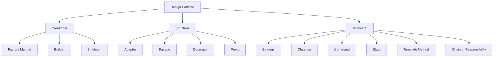

---

## 4. Nhóm 1: Creational Patterns

Nhóm này giải quyết câu hỏi: "Tạo object như thế nào để code dễ thay đổi và dễ mở rộng?"

### Gợi ý nhận biết nhanh

- constructor quá dài
- logic `new` nằm rải khắp nơi
- cần đổi implementation theo config hoặc môi trường

## Factory Method

### Vấn đề

Code tạo object bị rải rác khắp nơi, khó đổi implementation.

### Ý nghĩa

Đóng gói logic khởi tạo object vào một điểm, giúp ẩn chi tiết implementation.

### Khi nào dùng

- cần chọn implementation theo config
- object tạo phức tạp
- có nhiều loại object cùng chung interface

### Khi nào không nên dùng

- object rất đơn giản
- chỉ có một implementation ổn định, không có nhu cầu thay đổi

### Ví dụ

```ts
interface Notifier {
  send(message: string): void;
}

class EmailNotifier implements Notifier {
  send(message: string) {
    console.log(`Email: ${message}`);
  }
}

class SmsNotifier implements Notifier {
  send(message: string) {
    console.log(`SMS: ${message}`);
  }
}

class NotifierFactory {
  static create(channel: "email" | "sms"): Notifier {
    if (channel === "email") return new EmailNotifier();
    return new SmsNotifier();
  }
}
```

### Tradeoff

- thêm một lớp trung gian
- đổi lại logic khởi tạo được gom lại, code gọi gọn hơn

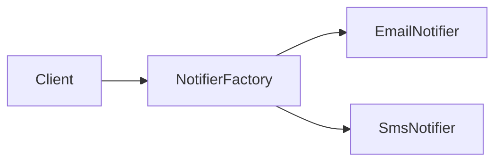

---

## Builder

### Vấn đề

Object có quá nhiều field optional, constructor dài và khó đọc.

### Ý nghĩa

Builder giúp tạo object từng bước, rõ nghĩa, dễ validate.

### Khi nào dùng

- object có nhiều tham số
- có thứ tự xây dựng nhiều bước
- cần kiểm tra dữ liệu trước khi tạo object

### Khi nào không nên dùng

- object nhỏ, ít field
- constructor rõ ràng đã đủ

### Ví dụ

```ts
class ReportQuery {
  constructor(
    public from?: string,
    public to?: string,
    public country?: string,
    public includeRefunds?: boolean
  ) {}
}

class ReportQueryBuilder {
  private query = new ReportQuery();

  setPeriod(from: string, to: string) {
    this.query.from = from;
    this.query.to = to;
    return this;
  }

  setCountry(country: string) {
    this.query.country = country;
    return this;
  }

  includeRefunds() {
    this.query.includeRefunds = true;
    return this;
  }

  build() {
    return this.query;
  }
}
```

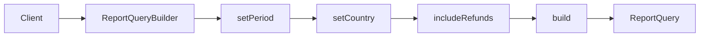

---

## Singleton

### Vấn đề

Bạn muốn đảm bảo chỉ có một instance cho một loại object, ví dụ config loader hoặc logger gốc.

### Ý nghĩa

Singleton giới hạn số instance và cung cấp một điểm truy cập dùng chung.

### Khi nào dùng

- đối tượng phải là duy nhất theo process
- việc tạo nhiều instance gây lỗi logic hoặc lãng phí

### Khi nào không nên dùng

- khi nó làm code khó test
- khi thực chất bạn chỉ đang né dependency injection

### Tradeoff

- thuận tiện
- nhưng dễ tạo global state, tăng coupling ẩn

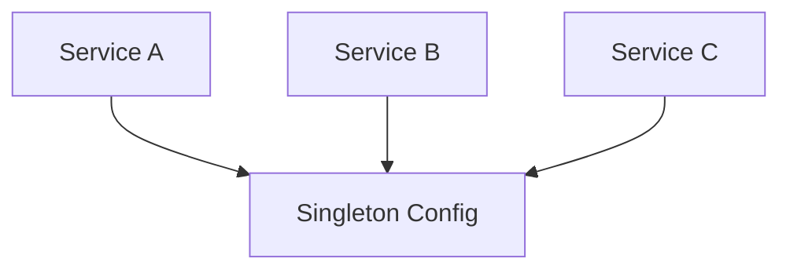

---

## 5. Nhóm 2: Structural Patterns

Nhóm này giải quyết câu hỏi: "Ghép các phần lại với nhau như thế nào để hệ thống gọn và ít phụ thuộc?"

### Gợi ý nhận biết nhanh

- code tích hợp vendor làm bẩn domain
- một use case phải gọi quá nhiều service con
- cần thêm logging/cache mà không muốn sửa class gốc

## Adapter

### Vấn đề

Cần tích hợp system bên ngoài có interface không phù hợp với code hiện tại.

### Ý nghĩa

Adapter đóng vai bộ chuyển đổi, giữ phần còn lại của hệ thống không bị nhiễm chi tiết bên ngoài.

### Khi nào dùng

- payment gateway
- vendor shipping API
- third-party identity provider

### Khi nào không nên dùng

- khi chính bạn kiểm soát cả hai đầu và có thể sửa interface gốc

### Tradeoff

- thêm một lớp mapping
- nhưng giúp cô lập third-party và giảm ảnh hưởng khi vendor đổi API

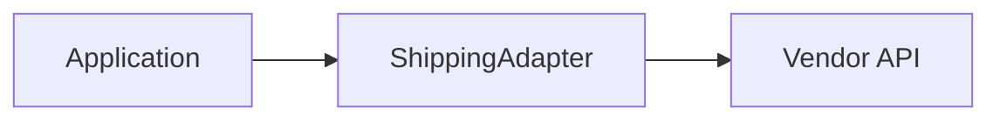

---

## Facade

### Vấn đề

Một quy trình nghiệp vụ cần gọi nhiều subsystem, client code trở nên rối.

### Ý nghĩa

Facade che đi độ phức tạp, đưa ra interface đơn giản cho use case.

### Ví dụ

`OrderFacade.placeOrder()` có thể gọi:

- validate cart
- reserve inventory
- create order
- request payment
- publish event

### Khi nào dùng

- use case có nhiều bước
- client không nên biết quá nhiều subsystem

### Tradeoff

- đơn giản hóa điểm gọi
- nhưng nếu lạm dụng có thể biến facade thành "god object"

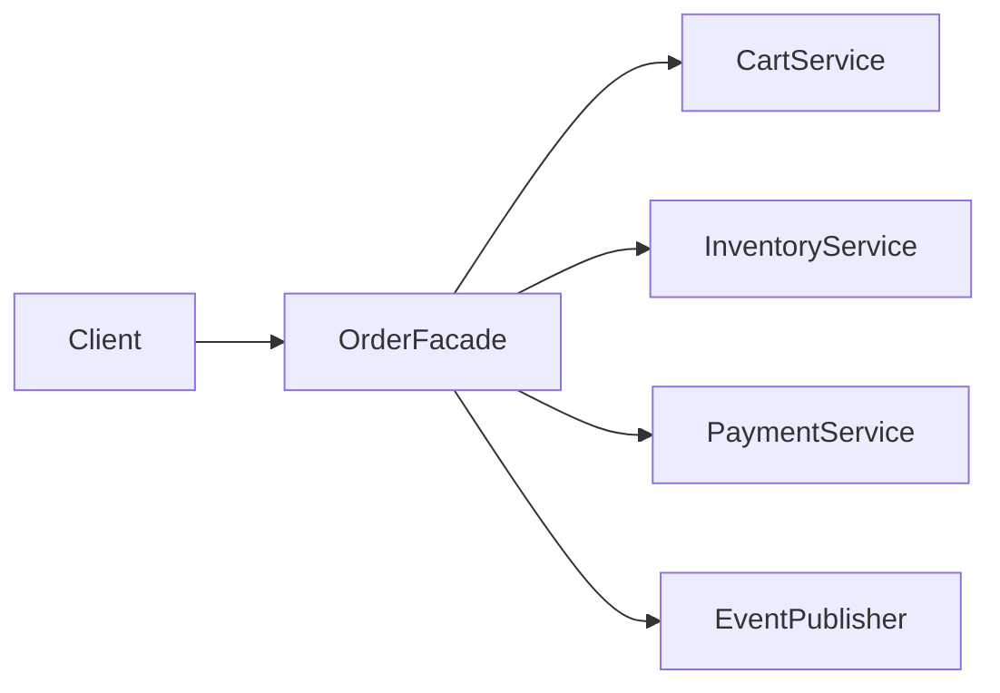

---

## Decorator

### Vấn đề

Bạn cần thêm hành vi vào object mà không muốn sửa class gốc hoặc tạo quá nhiều subclass.

### Ý nghĩa

Decorator bọc object gốc bằng các lớp thêm hành vi như logging, caching, retry, metrics.

### Khi nào dùng

- thêm cross-cutting behavior
- muốn xâu chuỗi nhiều hành vi

### Khi nào không nên dùng

- chuỗi decorator quá dài, khó debug
- hành vi cốt lõi đã bị che mờ

### Ví dụ thực tế

- repository có thêm cache decorator
- API client có retry decorator

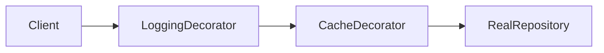

---

## Proxy

### Vấn đề

Bạn muốn kiểm soát truy cập tới một object khác: lazy load, kiểm tra quyền, caching, remote call.

### Ý nghĩa

Proxy có cùng interface với object thật nhưng chặn ở giữa để kiểm soát cách truy cập.

### Khi nào dùng

- lazy initialization
- access control
- remote proxy
- virtual proxy cho tài nguyên nặng

### Tradeoff

- trong suốt với client
- nhưng tăng độ phức tạp và có thể gây hiểu nhầm nếu logic ẩn quá nhiều

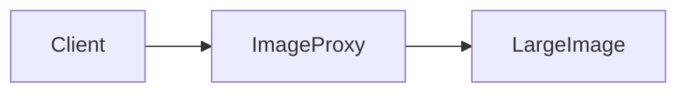

---

## Repository

### Vấn đề

Business logic bị dính chặt vào SQL/ORM.

### Ý nghĩa

Repository tạo boundary giữa domain và persistence.

### Khi nào dùng

- muốn bảo vệ domain khỏi chi tiết database
- muốn test domain/service dễ hơn

### Khi nào không nên dùng

- dùng repository chỉ để bọc từng hàm ORM một cách máy móc

### Cảnh báo

Không nên dùng repository như một lớp "wrapper vô nghĩa". Chỉ nên có khi nó giúp ẩn persistence và bảo vệ domain model.

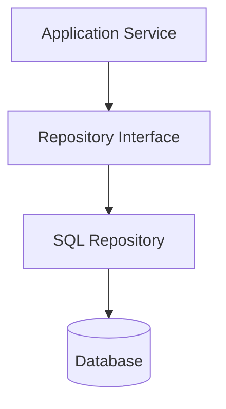

---

## 6. Nhóm 3: Behavioral Patterns

Nhóm này giải quyết câu hỏi: "Các object nên phối hợp hành vi với nhau như thế nào?"

### Gợi ý nhận biết nhanh

- quá nhiều `if/else` theo từng trường hợp
- một event cần nhiều nơi phản ứng
- một object có nhiều trạng thái sống
- request đi qua nhiều bước xử lý

## Strategy

### Vấn đề

Bạn có nhiều cách xử lý cùng một loại nghiệp vụ, thường dẫn đến `if/else` dài.

### Ý nghĩa

Tách từng hành vi thành một strategy riêng, giúp thêm quy tắc mới mà không sửa class chính quá nhiều.

### Khi nào dùng

- nhiều cách tính giá
- nhiều cách gửi thông báo
- nhiều chính sách discount

### Khi nào không nên dùng

- chỉ có một cách xử lý và ít khả năng thay đổi

### Ví dụ

```ts
interface PaymentStrategy {
  pay(amount: number): void;
}

class CardPayment implements PaymentStrategy {
  pay(amount: number) {
    console.log(`Pay ${amount} by card`);
  }
}

class WalletPayment implements PaymentStrategy {
  pay(amount: number) {
    console.log(`Pay ${amount} by wallet`);
  }
}

class CheckoutService {
  constructor(private payment: PaymentStrategy) {}

  checkout(amount: number) {
    this.payment.pay(amount);
  }
}
```

### Tradeoff

- thêm nhiều class
- nhưng code rõ và mở rộng hơn

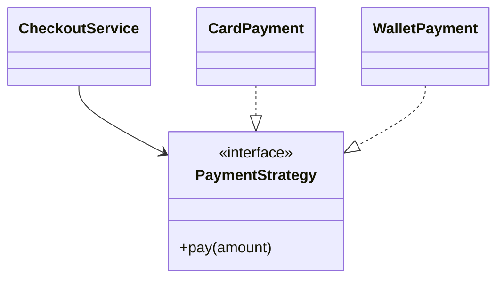

---

## Observer

### Vấn đề

Khi một sự kiện xảy ra, nhiều thành phần cần phản ứng.

### Ý nghĩa

Observer giảm phụ thuộc trực tiếp giữa publisher và subscriber.

### Khi nào dùng

- user đăng ký mới
- order đã thanh toán
- report đã được tạo

### Khi nào không nên dùng

- flow yêu cầu thứ tự rất chặt và khó chấp nhận eventual consistency

### Tradeoff

- thêm tính mở rộng
- nhưng flow có thể khó lần theo hơn

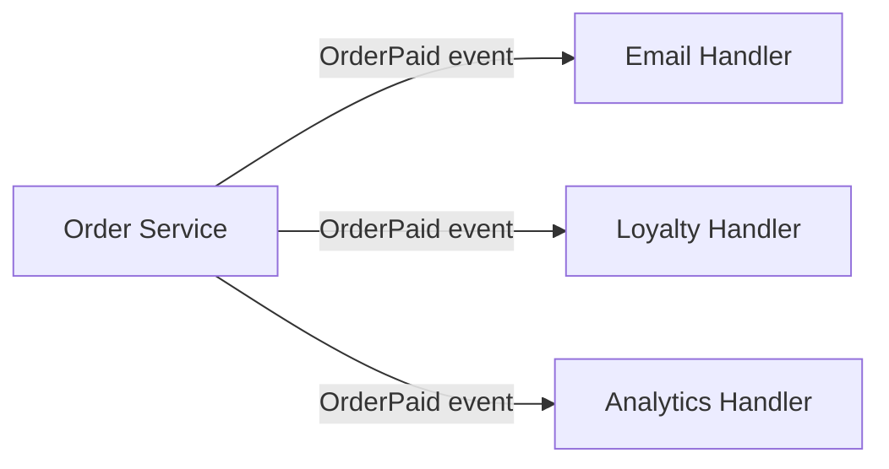

---

## Command

### Vấn đề

Bạn muốn đóng gói một action thành object để queue, retry, log, undo hoặc xử lý bất đồng bộ.

### Ý nghĩa

Command rất hữu ích khi xây task queue, job system, background processing.

### Khi nào dùng

- background job
- undo/redo
- audit action
- deferred execution

### Tradeoff

- nhiều object nhỏ
- nhưng action được chuẩn hóa và quản lý tốt hơn

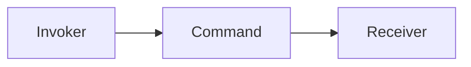

---

## State

### Vấn đề

Một object có nhiều trạng thái, và hành vi thay đổi theo trạng thái. Nếu viết bằng `if/else` hoặc `switch` dài sẽ rất khó bảo trì.

### Ý nghĩa

State tách hành vi theo từng trạng thái ra thành các class riêng.

### Khi nào dùng

- order lifecycle
- payment status
- document approval flow

### Ví dụ thực tế

Đơn hàng có thể ở các trạng thái:

- Pending
- Paid
- Shipped
- Cancelled

Mỗi trạng thái cho phép tập hành động khác nhau.

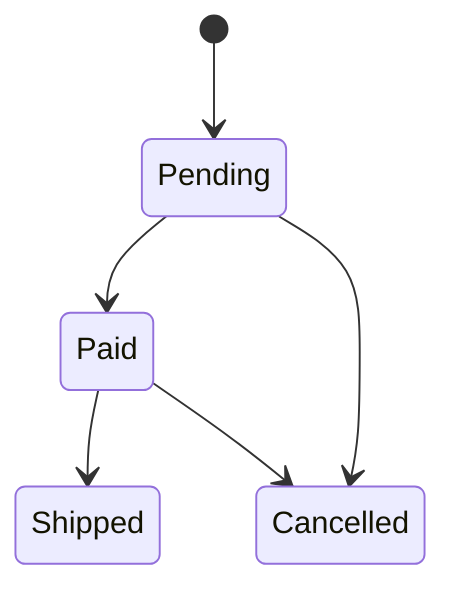

---

## Template Method

### Vấn đề

Bạn có nhiều quy trình gần giống nhau, chỉ khác vài bước nhỏ.

### Ý nghĩa

Template Method định nghĩa skeleton của thuật toán ở class cha, còn class con ghi đè một số bước.

### Khi nào dùng

- import file nhiều định dạng
- pipeline xử lý có các bước cố định
- workflow dùng chung khung

### Tradeoff

- tái sử dụng logic chung tốt
- nhưng dùng inheritance nhiều quá có thể cứng nhắc

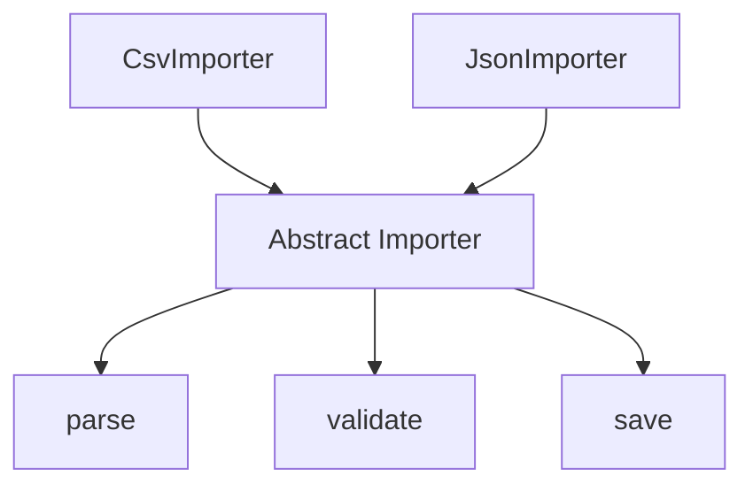

---

## Chain of Responsibility

### Vấn đề

Một request cần đi qua nhiều bước xử lý nối tiếp, và mỗi bước có thể xử lý hoặc chuyền tiếp.

### Ý nghĩa

Pattern này giúp tách từng bước kiểm tra/biến đổi thành các handler độc lập.

### Khi nào dùng

- middleware HTTP
- validation pipeline
- approval workflow

### Tradeoff

- dễ thêm bớt bước
- nhưng luồng xử lý có thể khó theo dõi nếu chain quá dài

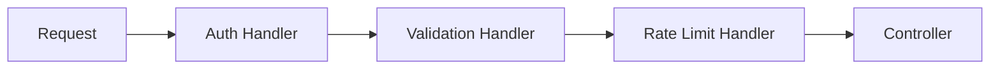

---

## Dependency Injection

### Vấn đề

Class tự tạo dependency, dẫn đến coupling cao và khó test.

### Ý nghĩa

Dependency Injection đảo chiều quyền tạo dependency, giúp test và thay implementation dễ dàng.

### Khi nào dùng

- service có nhiều dependency
- cần mock trong test
- muốn tách interface khỏi implementation

### Khi nào không nên dùng

- với object cực nhỏ, sống cục bộ, không có ý nghĩa abstraction

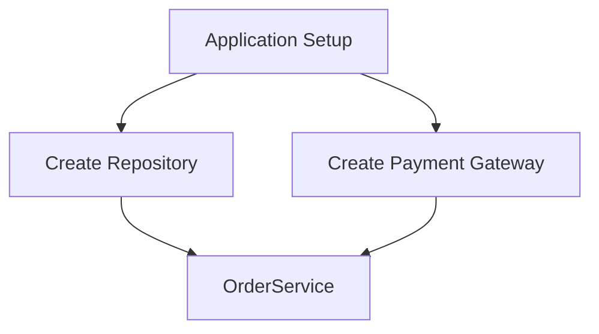

---

## 7. Bảng chọn pattern nhanh

| Vấn đề | Pattern phù hợp |
|---|---|
| Nhiều cách xử lý cùng một nghiệp vụ | Strategy |
| Cần gom logic tạo object | Factory Method |
| Object có nhiều tham số | Builder |
| Tích hợp API bên ngoài | Adapter |
| Ẩn quy trình nhiều bước | Facade |
| Gắn thêm logging/cache/retry | Decorator |
| Cần publish event cho nhiều nơi | Observer |
| Queue hoặc undo action | Command |
| Hành vi thay đổi theo trạng thái | State |
| Request đi qua nhiều bước | Chain of Responsibility |
| Bảo vệ domain khỏi ORM/SQL | Repository |
| Giảm coupling, dễ test | Dependency Injection |

> Dùng bảng này như mục tra cứu nhanh khi đọc code hoặc thiết kế use case mới.

## 8. Thứ tự học để dễ tiêu hóa

1. Strategy
2. Factory Method
3. Dependency Injection
4. Adapter
5. Facade
6. Observer
7. Builder
8. Decorator
9. Command
10. State
11. Chain of Responsibility
12. Repository
13. Proxy
14. Template Method
15. Singleton

## 9. Lỗi học pattern phổ biến

- học thuộc định nghĩa nhưng không biết bài toán
- làm quá mức, pattern hóa mọi thứ
- gặp đâu cũng đòi pattern
- bỏ qua tradeoff
- nhầm design pattern với architecture pattern

### Cảnh báo quan trọng

> Pattern tốt là pattern làm code đơn giản hơn sau 3 tháng, không phải pattern làm sơ đồ đẹp hơn trong 30 phút.

## 10. Mẹo nhớ nhanh

- **Creational**: tạo object thế nào cho gọn
- **Structural**: ghép object thế nào cho sạch
- **Behavioral**: phối hợp hành vi thế nào cho rõ

## 11. Ví dụ từng loại hệ thống nên dùng pattern nào

Phần này rất quan trọng vì giúp bạn nối pattern với bài toán thật. Không có pattern nào "đúng cho mọi hệ thống". Ta chọn pattern theo vấn đề nổi bật của hệ thống đó.

## Hệ thống E-commerce

### Bài toán thường gặp

- nhiều loại thanh toán
- quy trình đặt hàng nhiều bước
- tích hợp kho, vận chuyển, thanh toán
- cần gửi email, thông báo, analytics sau khi đặt hàng

### Pattern phù hợp

- **Strategy**: cho nhiều cách thanh toán, nhiều cách tính phí ship, nhiều chương trình giảm giá
- **Factory Method**: tạo payment provider hoặc shipping provider theo cấu hình
- **Facade**: gom flow `placeOrder()` thành một điểm gọi
- **Adapter**: nối với cổng thanh toán, hãng vận chuyển bên ngoài
- **Observer**: phát event sau khi order thành công
- **State**: quản lý vòng đời đơn hàng
- **Repository**: tách domain order khỏi database
- **Decorator**: thêm cache hoặc logging cho repository/client

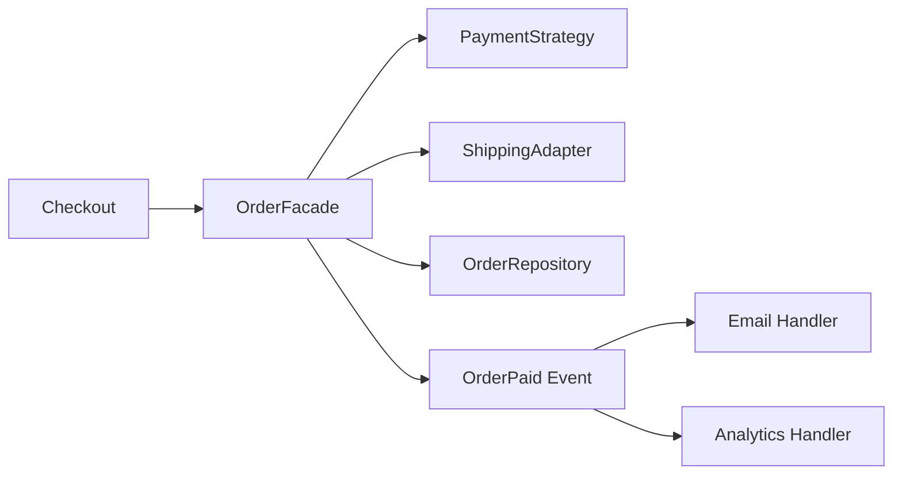

## Hệ thống Thanh toán

### Bài toán thường gặp

- nhiều provider
- retry và idempotency
- trạng thái giao dịch thay đổi
- yêu cầu audit cao

### Pattern phù hợp

- **Strategy**: chọn logic xử lý theo từng payment method
- **Adapter**: tích hợp Stripe, PayPal, MoMo, VNPay
- **State**: quản lý `Pending`, `Authorized`, `Captured`, `Failed`, `Refunded`
- **Command**: đóng gói tác vụ charge, refund, retry
- **Chain of Responsibility**: validation request, fraud check, limit check
- **Decorator**: thêm audit log, metrics, retry wrapper

## Hệ thống Notification

### Bài toán thường gặp

- nhiều kênh gửi: email, SMS, push
- mỗi kênh có provider khác nhau
- cần fallback khi provider lỗi

### Pattern phù hợp

- **Strategy**: mỗi kênh gửi là một chiến lược
- **Factory Method**: tạo sender theo channel
- **Adapter**: tích hợp từng provider bên ngoài
- **Command**: đẩy tác vụ gửi vào queue
- **Decorator**: retry, rate limit, logging
- **Observer**: nhận event từ hệ thống khác để gửi thông báo

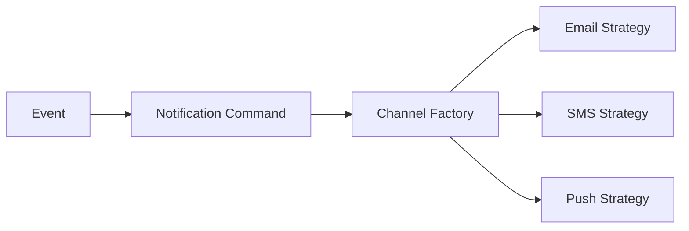

## Hệ thống Booking / Reservation

### Bài toán thường gặp

- nhiều trạng thái đặt chỗ
- timeout giữ chỗ
- nhiều bước xác nhận
- dễ bị race condition

### Pattern phù hợp

- **State**: quản lý `Available`, `Held`, `Booked`, `Expired`
- **Facade**: gom flow đặt chỗ
- **Command**: xử lý tác vụ giữ chỗ, xác nhận, hết hạn
- **Observer**: phát event sau khi đặt chỗ thành công
- **Repository**: quản lý aggregate booking

## Hệ thống CMS / Approval Workflow

### Bài toán thường gặp

- nội dung đi qua nhiều bước duyệt
- quyền hạn khác nhau
- hành vi thay đổi theo trạng thái bài viết

### Pattern phù hợp

- **State**: Draft, Review, Approved, Published, Rejected
- **Chain of Responsibility**: chuỗi duyệt hoặc chuỗi validate
- **Template Method**: pipeline xuất bản theo khung chung
- **Command**: approve, reject, publish

## Hệ thống Import/Export dữ liệu

### Bài toán thường gặp

- nhiều định dạng file
- quy trình đọc, validate, transform, save gần giống nhau

### Pattern phù hợp

- **Template Method**: giữ skeleton của pipeline import
- **Strategy**: chọn parser theo loại file
- **Factory Method**: tạo parser phù hợp
- **Command**: chạy import job bất đồng bộ

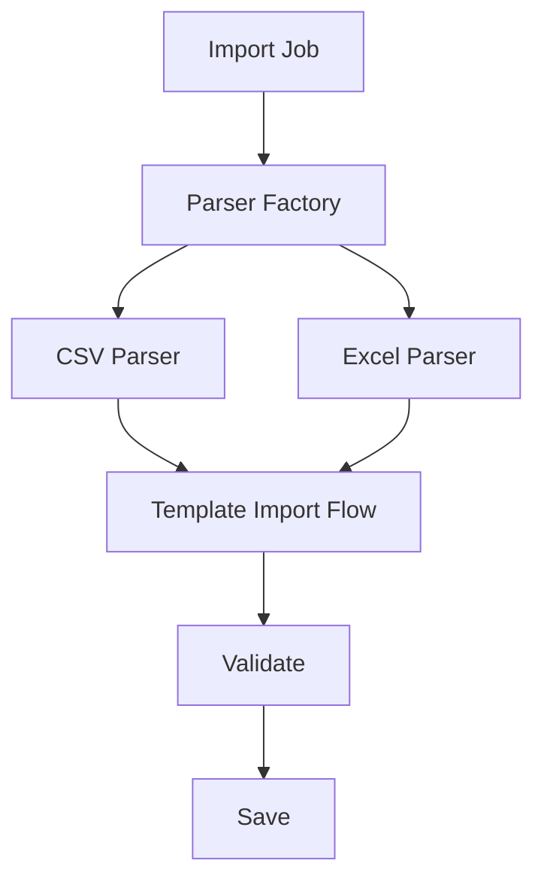

## Hệ thống API Gateway / Middleware Pipeline

### Bài toán thường gặp

- request đi qua nhiều bước kiểm tra
- auth, validation, rate limit, logging

### Pattern phù hợp

- **Chain of Responsibility**: rất hợp cho middleware pipeline
- **Decorator**: thêm logging, caching, metrics quanh handler
- **Proxy**: chặn truy cập, kiểm soát gọi sang service khác

## Hệ thống Tích hợp Third-party

### Bài toán thường gặp

- mỗi vendor có API khác nhau
- vendor thay đổi version
- muốn bảo vệ code nội bộ khỏi phụ thuộc ngoài

### Pattern phù hợp

- **Adapter**: gần như pattern bắt buộc
- **Facade**: đưa ra API nội bộ đơn giản cho team dùng
- **Factory Method**: chọn vendor implementation
- **Decorator**: thêm retry, circuit breaker, logging

## Hệ thống Báo cáo / Analytics

### Bài toán thường gặp

- nhiều nguồn dữ liệu
- nhiều kiểu truy vấn
- nhiều cách xuất báo cáo

### Pattern phù hợp

- **Builder**: tạo report query phức tạp
- **Strategy**: nhiều cách tính KPI hoặc aggregation
- **Template Method**: pipeline tạo báo cáo
- **Facade**: tạo service báo cáo đơn giản cho client

## Hệ thống Workflow / Job Processing

### Bài toán thường gặp

- nhiều job nền
- retry, delay, audit
- mỗi loại job xử lý khác nhau

### Pattern phù hợp

- **Command**: pattern rất hợp để biểu diễn job
- **Strategy**: chọn cách xử lý theo loại job
- **Observer**: bắn event sau khi job hoàn thành
- **State**: quản lý trạng thái job

## Hệ thống IoT / Event-driven

### Bài toán thường gặp

- nhiều thiết bị gửi event
- nhiều consumer phản ứng khác nhau
- cần xử lý theo loại event

### Pattern phù hợp

- **Observer**: pattern tự nhiên nhất
- **Strategy**: xử lý từng loại event khác nhau
- **Command**: đóng gói tác vụ xử lý bất đồng bộ
- **Adapter**: chuẩn hóa giao tiếp với nhiều loại thiết bị

## Hệ thống Game

### Bài toán thường gặp

- nhân vật có nhiều trạng thái
- hành vi thay đổi theo mode
- nhiều command điều khiển

### Pattern phù hợp

- **State**: idle, running, attacking, dead
- **Strategy**: AI behavior, movement behavior
- **Command**: input command, undo/replay
- **Observer**: event trong game như score, collision, achievement

## Hệ thống Monolith nghiệp vụ lớn

### Bài toán thường gặp

- code phình to
- service gọi lẫn nhau
- business logic dính ORM/framework

### Pattern phù hợp

- **Facade**: gom use case
- **Repository**: bảo vệ domain
- **Dependency Injection**: giảm coupling
- **Decorator**: thêm cross-cutting concern
- **Strategy**: tách logic biến thể

## 12. Cách chọn pattern theo dấu hiệu nhận biết

Nếu bạn thấy:

- quá nhiều `if/else` theo từng biến thể hành vi -> **Strategy**
- object khởi tạo phức tạp -> **Builder** hoặc **Factory Method**
- code tích hợp vendor làm bẩn domain -> **Adapter**
- một use case gọi 5-7 service con -> **Facade**
- muốn thêm cache/logging/retry mà không sửa class gốc -> **Decorator**
- một action cần queue/retry/undo -> **Command**
- object có nhiều trạng thái sống -> **State**
- request đi qua nhiều bước xử lý -> **Chain of Responsibility**
- một event cần nhiều nơi phản ứng -> **Observer**
- service dính chặt ORM/SQL -> **Repository**

## 13. Bài tập để luyện

1. Refactor notification service:
   - từ `if/else` sang Strategy + Factory Method
2. Refactor checkout flow:
   - dùng Facade cho use case đặt hàng
3. Tích hợp cổng thanh toán mới:
   - dùng Adapter
4. Thêm cache cho repository:
   - dùng Decorator
5. Xây pipeline request:
   - dùng Chain of Responsibility
6. Thiết kế order state:
   - dùng State
