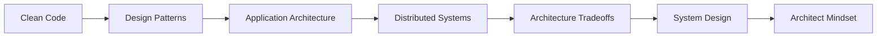

# Roadmap Học Software Architect

> Tài liệu này giúp bạn nhìn toàn cảnh lộ trình học Software Architecture từ nền tảng code đến tư duy ra quyết định ở cấp hệ thống.

## Tóm tắt nhanh

| Giai đoạn | Trọng tâm | Kết quả mong đợi |
|---|---|---|
| Tháng 1-2 | Code-level design và design patterns | Viết code rõ, dễ test, biết dùng pattern đúng chỗ |
| Tháng 3-4 | Application architecture và distributed systems | Thiết kế boundary tốt, hiểu failure mode |
| Tháng 5-6 | Tradeoff, system design, architect mindset | Chọn kiến trúc phù hợp và giải thích quyết định rõ ràng |

---

## 1. Mục tiêu của lộ trình

Software Architect không chỉ là người "vẽ sơ đồ". Vai trò này cần:

- hiểu business và biến nó thành system để vận hành được
- ra quyết định kỹ thuật có tradeoff rõ ràng
- giữ hệ thống dễ phát triển, dễ vận hành, dễ mở rộng
- giúp team code nhanh hơn mà không để lại nợ kỹ thuật quá lớn

Nói ngắn gọn: architect là người tối ưu khả năng thay đổi của hệ thống trong thời gian dài.

## 2. Năng lực cần có

> Hãy xem 5 nhóm năng lực này như 5 trụ cột. Thiếu một trụ, bạn vẫn có thể làm việc tốt trong ngắn hạn nhưng rất khó đi xa ở vai trò architect.

Bạn cần xây 5 nhóm năng lực:

1. **Code-level design**
   - clean code
   - refactoring
   - SOLID
   - design patterns

2. **Application architecture**
   - layered architecture
   - modular monolith
   - hexagonal architecture
   - DDD

3. **System architecture**
   - scalability
   - caching
   - messaging
   - consistency
   - resiliency

4. **Operations thinking**
   - logging
   - metrics
   - tracing
   - deployment
   - incident mindset

5. **Decision making**
   - phân tích tradeoff
   - viết ADR
   - ước lượng rủi ro
   - ưu tiên theo business

## 3. Roadmap 6 tháng

### Cách đọc phần này

- `Học gì`: các chủ đề nên nắm
- `Ý nghĩa`: vì sao chủ đề đó quan trọng
- `Đầu ra cần đạt`: cách tự kiểm tra mình đã học tới đâu
- `Bài tập`: cách biến kiến thức thành kỹ năng

---

## Tháng 1: Nền tảng kỹ thuật

### Học gì

- OOP, abstraction, encapsulation, polymorphism
- SOLID
- cohesion và coupling
- clean code, refactoring
- unit test và testability

### Ý nghĩa

Nếu bạn chưa thiết kế tốt ở mức class/module, bạn sẽ rất khó làm tốt ở mức system. System lớn được tạo từ nhiều quyết định nhỏ.

### Đầu ra cần đạt

- viết được code dễ đọc, dễ test, dễ thay đổi
- nhận ra code smell cơ bản
- giải thích được tại sao class/module đang bị coupling cao

### Bài tập

- refactor một service 300-500 dòng thành các module rõ trách nhiệm
- viết ADR ngắn: "tại sao tách module A/B"

> Ghi nhớ: architect giỏi thường bắt đầu từ việc nhìn ra code smell và boundary mờ ở những đoạn code rất bình thường.

---

## Tháng 2: Design Patterns cốt lõi

### Học gì

- Strategy
- Factory Method
- Builder
- Adapter
- Facade
- Observer
- Command
- Decorator
- Repository
- Dependency Injection

### Ý nghĩa

Pattern không phải để "học thuộc", mà để nhìn ra một vấn đề quen thuộc và áp dụng một cách giải có tên, có tradeoff.

### Đầu ra cần đạt

- nhìn code và nói được pattern nào đang xuất hiện
- biết khi nào dùng pattern, khi nào bỏ qua
- refactor được code từ `if/else` phức tạp sang Strategy hoặc Command

---

## Tháng 3: Application Architecture

### Học gì

- Layered architecture
- Clean architecture
- Hexagonal architecture
- Modular monolith
- CQRS basics
- coupling, modularity, decomposition từ track `Software Architecture: The Hard Parts`

### Ý nghĩa

Đây là tầng chuyển từ "thiết kế class" sang "thiết kế ứng dụng". Bạn bắt đầu quan tâm đến boundary, dependency direction, testability và khả năng mở rộng của codebase.

### Đầu ra cần đạt

- tách domain ra khỏi framework
- thiết kế boundary giữa application/domain/infrastructure
- biết khi nào modular monolith tốt hơn microservices

---

## Tháng 4: Data và Distributed Systems

### Học gì

- transaction, isolation, locking
- cache aside
- message queue
- eventual consistency
- idempotency
- retry, timeout, circuit breaker
- data decomposition
- service granularity

### Ý nghĩa

Khi system lớn lên, vấn đề không còn là "viết code đúng" mà là "hệ thống có sống sót khi load cao, lỗi mạng, race condition, data lệch hay không".

### Đầu ra cần đạt

- giải thích được tại sao distributed systems khó
- biết cách giảm coupling bằng event/message
- biết các failure mode phổ biến

> Ghi nhớ: từ giai đoạn này trở đi, "đúng logic" là chưa đủ. Bạn phải bắt đầu nghĩ đến timeout, retry, race condition, consistency và quan sát hệ thống khi có lỗi.

---

## Tháng 5: Architecture Styles và Tradeoff

### Học gì

- monolith
- modular monolith
- microservices
- event-driven architecture
- serverless
- DDD strategic design
- reuse patterns
- data ownership
- distributed data access
- orchestration và choreography
- transactional saga

### Ý nghĩa

Architect giỏi không chọn xu hướng, mà chọn dạng bài toán phù hợp. Mỗi kiểu kiến trúc đều có giá phải trả.

### Đầu ra cần đạt

- so sánh được các architecture style
- chọn được style phù hợp với team 5 người, 50 người, 500 người
- viết được ADR có lý do và rủi ro

---

## Tháng 6: System Design và Tầm nhìn Architect

### Học gì

- non-functional requirements
- capacity estimation
- service boundaries
- observability
- security basics
- architecture review
- contracts
- data mesh
- trade-off analysis

### Ý nghĩa

Lúc này bạn không chỉ học "component nào ở đâu" mà học cách đưa ra quyết định dưới áp lực business, time, budget và team capability.

### Đầu ra cần đạt

- design một hệ thống từ requirement
- vẽ context diagram, container diagram, sequence diagram
- trình bày tradeoff rõ ràng

---

## 4. Lịch học hằng tuần

### Nhịp học gợi ý

> Công thức đơn giản: `đọc -> code -> refactor -> vẽ -> review`.  
> Nếu tuần nào bạn chỉ đọc mà không vẽ hoặc không refactor, kiến thức sẽ rất khó bám.

### Đề xuất 8-10 giờ mỗi tuần

1. **2 giờ lý thuyết**
   - đọc một chủ đề
2. **3 giờ code**
   - làm ví dụ nhỏ
3. **2 giờ refactor**
   - áp dụng vào code cũ
4. **1 giờ diagram**
   - vẽ lại architecture bằng Mermaid hoặc draw.io
5. **1-2 giờ review**
   - viết note: vấn đề, pattern, tradeoff, bài học

## 5. Book Track: Software Architecture: The Hard Parts

Track này nên được học song song từ tháng 3 đến tháng 6:

- **Tháng 3**
  - coupling
  - architecture quantum
  - modularity
  - decomposition

- **Tháng 4**
  - data decomposition
  - service granularity

- **Tháng 5**
  - reuse patterns
  - data ownership
  - distributed data access
  - orchestration và choreography
  - transactional saga

- **Tháng 6**
  - contracts
  - analytical data
  - data mesh
  - trade-off analysis

Lý do thêm track này vào course:

- giúp chuyển từ học khái niệm sang học ra quyết định
- làm rõ mặt khó của distributed architecture
- rèn cách dùng ADR và trade-off language thay vì best-practice language

## 6. Cách học để lên nhanh

- học theo vấn đề, không học theo định nghĩa thuộc lòng
- mỗi pattern hay architecture đều phải trả lời 4 câu:
  - nó giải quyết vấn đề gì
  - nó đổi lại cái gì
  - lúc nào nên dùng
  - lúc nào không nên dùng
- mỗi tháng có 1 project nhỏ để tổng hợp

### Checklist tự học

- Tôi có thể giải thích chủ đề này bằng ví dụ thực tế không?
- Tôi có thể vẽ lại nó bằng diagram không?
- Tôi có thể chỉ ra tradeoff không?
- Tôi có thể áp dụng nó vào code của mình không?

## 6. Portfolio projects nên làm

1. **E-commerce monolith có module rõ ràng**
   - user
   - catalog
   - cart
   - order
   - payment facade

2. **Booking system**
   - availability
   - reservation
   - timeout booking
   - event-driven notification

3. **Notification platform**
   - email/sms/push
   - Strategy + Factory + Queue

4. **Order processing system**
   - saga đơn giản
   - retry/idempotency
   - outbox pattern

---

## 7. Milestone tự đánh giá

### Dấu hiệu bạn đang tiến bộ đúng hướng

- bắt đầu nhìn code theo boundary thay vì chỉ theo file
- bớt hỏi "nên dùng pattern nào", hỏi nhiều hơn "vấn đề thật là gì"
- có thể tranh luận kiến trúc bằng tradeoff thay vì cảm tính

Sau 6 tháng, bạn nên tự trả lời được:

- tôi có phân biệt được design pattern và architecture style không
- tôi có giải thích được tradeoff không
- tôi có thiết kế được boundary và dependency direction không
- tôi có biết vì sao data consistency là vấn đề khó không
- tôi có trình bày được một system design rõ ràng cho team không

## 8. Sơ đồ nâng cấp năng lực

