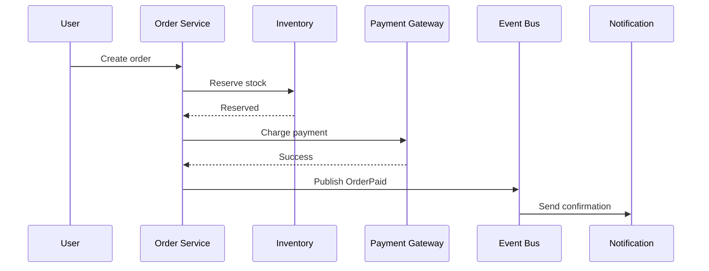

# Bài Tập và Cách Luyện Architect Thinking

> Phần này biến kiến thức thành phản xạ. Mỗi bài tập không chỉ để "thiết kế cho xong", mà để luyện cách đặt câu hỏi, nhận diện rủi ro và nói rõ tradeoff.

## Cách dùng tài liệu này

| Bước | Việc cần làm |
|---|---|
| 1 | Đọc đề và viết lại requirement bằng ngôn ngữ của bạn |
| 2 | Xác định NFR và scale |
| 3 | Vẽ sơ đồ đơn giản trước |
| 4 | Chọn component và data flow |
| 5 | Chỉ ra bottleneck, failure mode, tradeoff |
| 6 | Viết lại giải pháp ngắn gọn như đang trình bày cho team |

---

## 1. Cách luyện đúng

Mỗi bài tập system design nên đi theo 8 bước:

1. làm rõ requirement chức năng
2. làm rõ NFR
3. ước lượng scale
4. xác định component chính
5. xác định data flow
6. chỉ ra bottleneck và failure mode
7. đưa ra tradeoff
8. đề xuất next iteration

### Mẹo luyện

- đừng nhảy vào vẽ microservices quá sớm
- luôn hỏi dữ liệu đi đâu trước khi hỏi service nào tồn tại
- luôn nói rõ giả định của bạn

---

## 2. Bài tập 1: Design URL Shortener

### Mục tiêu học

- read/write pattern
- key generation
- caching
- database indexing

### Câu hỏi cần trả lời

- làm sao sinh short code không trùng
- redirect nhanh bằng cache thế nào
- làm sao thống kê click mà không ảnh hưởng latency redirect

### Bạn sẽ luyện được gì

- đọc/ghi bất đối xứng
- tối ưu đường nóng
- tách write path và analytics path

---

## 3. Bài tập 2: Design E-commerce Order Flow

### Mục tiêu học

- service boundary
- inventory consistency
- payment integration
- notification async

### Diagram gợi ý

### Điểm cần chú ý

- payment thất bại thì rollback logic ra sao
- reserve stock ở bước nào là hợp lý
- notification nên đồng bộ hay bất đồng bộ

---

## 4. Bài tập 3: Design Booking System

### Mục tiêu học

- concurrent booking
- temporary reservation
- expiration
- read model và availability

### Vấn đề khó

- 2 người đặt cùng 1 slot
- slot giữ cho user trong 10 phút rồi hết hạn

### Điểm cần chú ý

- khóa dữ liệu ở đâu
- xử lý timeout bằng job hay scheduler
- consistency cần mạnh đến mức nào

---

## 5. Bài tập 4: Design Notification Platform

### Mục tiêu học

- multi-channel delivery
- retry
- template management
- provider failover

### Pattern gợi ý

- Strategy
- Factory
- Adapter
- Queue

### Điểm cần chú ý

- retry bao nhiêu lần là hợp lý
- provider lỗi thì fallback thế nào
- template được quản lý tập trung hay phân tán

---

## 6. Bài tập 5: Design Audit Log System

### Mục tiêu học

- immutable event
- searchability
- storage growth
- security và compliance

### Điểm cần chú ý

- log nào được phép sửa, log nào tuyệt đối không
- retention bao lâu
- ai được quyền truy cập

---

## 7. Mẫu review cho mỗi bài

Sau khi design xong, tự review theo checklist:

- boundary có rõ không
- dependency có hợp lý không
- data consistency được xử lý chưa
- failure mode đã được nói đến chưa
- monitoring/logging/metrics đã có chưa
- có giải thích tradeoff không

### Chấm điểm nhanh cho chính bạn

| Tiêu chí | Tự chấm 1-5 |
|---|---|
| Rõ requirement |   |
| Rõ NFR |   |
| Boundary hợp lý |   |
| Data flow rõ |   |
| Nói được tradeoff |   |
| Nói được failure mode |   |

## 8. Cách biến bài tập thành portfolio

Mỗi bài tập nên có:

- problem statement
- assumptions
- context diagram
- container/component diagram
- sequence diagram
- database choice
- scaling strategy
- ADR ngắn
- rủi ro và lần nâng cấp tiếp theo

> Portfolio tốt không cần quá nhiều bài. Chỉ cần 2-3 bài nhưng phân tích sâu, có diagram sạch và có tradeoff rõ là đủ mạnh.
